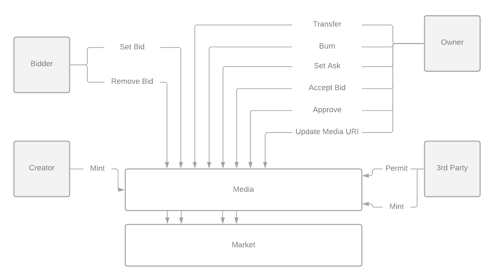
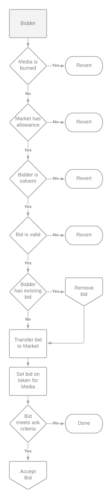
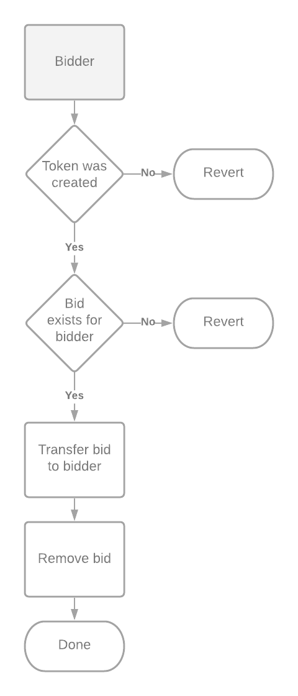
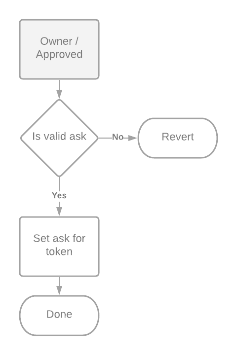
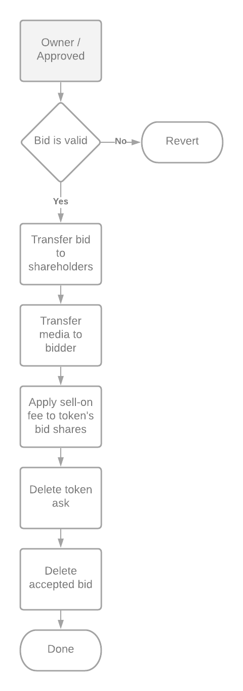

# Zora Media Protocol

This repository contains the core contracts that compose the Zora Media Protocol.

The protocol aims to provide a universal value system for media.

## Table of Contents

- [Whitepaper](#whitepaper)
- [Architecture](#architecture)
  - [Mint](#mint)
  - [Set Bid](#set-bid)
  - [Remove Bid](#remove-bid)
  - [Transfer](#transfer)
  - [Burn](#burn)
  - [Set Ask](#set-ask)
  - [Accept Bid](#accept-bid)
  - [Approve](#approve)
  - [Update Token and Media URI](#update-token-and-media-uri)
  - [Permit](#permit)
  - [Mint with Signature](#mint-with-signature)
- [Local Development](#Local-Development)
  - [Install Dependencies](#install-dependencies)
  - [Compile Contracts](#compile-contracts)
  - [Start a Local Blockchain](#start-a-local-blockchain)
  - [Run Tests](#run-tests)

## Whitepaper

Whitepaper coming soon.

## Architecture

This protocol is an extension of the ERC-721 NFT standard, intended to
provide a unified pool of liquidity in the form of bids in a market for each NFT.
This protocol refers to NFTs as `Media`.

The protocol's roles and methods interact with the core contracts as follows:


The following structs are defined in the contract and used as parameters for some methods:

```solidity
// Decimal.D256
struct D256 {
  uint256 value;
}

struct Bid {
  // Amount of the currency being bid
  uint256 amount;
  // Address to the ERC20 token being used to bid
  address currency;
  // Address of the bidder
  address bidder;
  // Address of the recipient
  address recipient;
  // % of the next sale to award the previous owner
  Decimal.D256 sellOnShare;
}

struct Ask {
  // Amount of the currency being asked
  uint256 amount;
  // Address to the ERC20 token being asked
  address currency;
  // % of the next sale to award the previous owner
  Decimal.D256 sellOnShare;
}

struct BidShares {
  // % of sale value that goes to the _previous_ owner of the nft
  Decimal.D256 prevOwner;
  // % of sale value that goes to the original creator of the nft
  Decimal.D256 creator;
  // % of sale value that goes to the seller (current owner) of the nft
  Decimal.D256 owner;
}

struct MediaData {
  // A valid URI of the content represented by this token
  string tokenURI;
  // A valid URI of the metadata associated with this token
  string metadataURI;
  // A SHA256 hash of the content pointed to by tokenURI
  bytes32 contentHash;
  // A SHA256 hash of the content pointed to by metadataURI
  bytes32 metadataHash;
}

struct EIP712Signature {
  uint256 deadline;
  uint8 v;
  bytes32 r;
  bytes32 s;
}

```

### Mint

At any time, a creator may mint a new piece of media. When a piece is minted, the new media is transferred to the creator and a market is formed.

| **Name**    | **Type**    | **Description**                                                                         |
| ----------- | ----------- | --------------------------------------------------------------------------------------- |
| `data`      | `MediaData` | The data represented by this media, including SHA256 hashes for future integrity checks |
| `bidShares` | `BidShares` | The percentage of bid fees that should be perpetually rewarded to the creator.          |


### Set Bid

Anyone may place a bid on a minted token. By placing a bid, the bidder deposits the currency of their choosing into
the market contract. Any valid ERC-20 currencies can be used to bid. Note that we strongly recommend that bidders do not bid using a currency that can be rebased, such as [AMPL](https://www.ampleforth.org/), [YAM](https://yam.finance/), or [BASED](https://based.money), as funds can become locked in the Market if the token is rebased.

| **Name**  | **Type**  | **Description**                        |
| --------- | --------- | -------------------------------------- |
| `tokenId` | `uint256` | The tokenID for the media being bid on |
| `bid`     | `Bid`     | The bid to be placed                   |



### Remove Bid

Once a bid has been set by a bidder, it can be removed. In order to remove a bid from a piece of media, the bidder simply specifies the piece of media that they wish to remove their bid from.
Note from the process flow diagram above for setting a bid that only one bid can be set a time per bidder per piece of media.

| **Name**  | **Type**  | **Description**                                      |
| --------- | --------- | ---------------------------------------------------- |
| `tokenId` | `uint256` | The tokenID for the media who's bid is being removed |



### Transfer

Any media owner is able to transfer their media to an address of their choosing. This does not alter the market for the media, except to remove the Ask on the piece, if it is present. Its implementation from the standard ERC721 standard is unchanged in this protocol.

### Burn

This protocol allows for media to be burned, if and only if the owner of the media is also the creator. When burned, the `tokenURI` and `metadataURI` of the media are not removed. This means that even though the market becomes inactive, the media is still viewable. Effectively, the media becomes read-only.
Any bids that were placed on a piece prior to it being burned can still be removed.

| **Name**  | **Type**  | **Description**                   |
| --------- | --------- | --------------------------------- |
| `tokenId` | `uint256` | The tokenID for the media to burn |


### Set Ask

At any time, an owner may set an Ask on their media. The ask serves to automatically fulfill a bid if it satisfies the parameters of the ask. This allows collectors to optionally buy a piece outright, without waiting for the owner to explicitly accept their bid.

| **Name**  | **Type**  | **Description**           |
| --------- | --------- | ------------------------- |
| `tokenId` | `uint256` | The tokenID for the media |
| `ask`     | `Ask`     | The ask to be set         |



### Accept Bid

When an owner sees a satisfactory bid, they can accept it and transfer the ownership of the piece to the bidder's recipient. The bid's funds are split according to the percentages defined in the piece's bid shares.
Note that bids can have a sell-on fee. This fee is to entitle the seller to a piece of the next sale of the media. For example, suppose someone owns a piece with a limited means of promoting it. In this case, it may be favorable to accept a bid from a highly regarded platform for a lower initial capital, but high potential resale fee.
Since the sell-on fee can be easily avoided by bidders with ill intent, it's suggested that owners only accept sell-on fee offers from reputable buyers.

| **Name**  | **Type**  | **Description**           |
| --------- | --------- | ------------------------- |
| `tokenId` | `uint256` | The tokenID for the media |
| `bid`     | `Bid`     | The bid to accept         |



### Approve

At any time, the owner of a piece of media is able to approve another address to act on its behalf.
This implementation is unchanged from the ERC-721 standard. However, approved addresses are now also able to accept bids,
set asks, update URIs, and burn media (provided the owner is the creator, as above).

### Update Token and Media URI

Although this protocol is designed to maintain perpetual markets for media, data availability of that media is considered
out of scope. However, in the event that the URIs that point to the data must be changed, this protocol offers the ability to update them.
Recall that when minting tokens, sha256 hashes of the content and metadata are provided for integrity checks. As a result, anyone is able to
check the integrity of the media if the URIs change.

This protocol deviates from the ERC-721 in that the `tokenURI` does **not** point to a valid ERC721 Metadata JSON Schema as defined in the EIP.
In order to support integrity checks when updating the tokenURIs, the content and metadata of a piece of media are split into `tokenURI` and `metadataURI`,
respectively. This split effectively allows for the reconfiguration of the URIs of both the content and metadata, while preserving integrity checks.

#### Metadata JSON schema

In order to enable anyone to use this protocol as they see fit, there is no single metadata JSON schema that is used for this protocol.
However, it is strongly recommended that developers submit a valid [JSON schema](https://json-schema.org/) to the
[Media Metadata Schemas Repository](https://github.com/ourzora/media-metadata-schemas) to allow anyone to support custom metadata.
The only **required** key of the JSON metadata is `version`, which is a string in the format of `<name-calVersion>` (e.g. `zora-20210101`).
This key can be used by implementing platforms to determine which metadata schemas to support.

### Permit

In order to provide support for third parties to interact with this protocol on a user's behalf, the EIP-712 standard for signing typed data structures is supported.
The protocol offers a `permit` method loosely based off of EIP-2612, with some adjustments made to support NFTs rather than ERC-20 currencies. The `Permit` EIP-712 data structure is as follows:

```typescript
{
  Permit: [
    { name: 'spender', type: 'address' },
    { name: 'tokenId', type: 'uint256' },
    { name: 'nonce', type: 'uint256' },
    { name: 'deadline', type: 'uint256' },
  ];
}
```

If the permit is applied, the specified `spender` is set as approved for the signer. Note that the `spender` will stay approved until the approval is revoked.

### Mint With Signature

If the media has yet to be minted yet, creators are able to permit a third party to mint on their behalf by signing a `MintWithSig` object. The structure is as follows:

```typescript
{
  MintWithSig: [
    { name: 'tokenURI', type: 'string' },
    { name: 'metadataURI', type: 'string' },
    { name: 'creatorShare', type: 'uint256' },
    { name: 'nonce', type: 'uint256' },
    { name: 'deadline', type: 'uint256' },
  ];
}
```

## Local Development

The following assumes `node >= 12`

### Install Dependencies

```shell script
yarn
```

### Compile Contracts

```shell script
yarn build
```

### Start a Local Blockchain

```shell script
yarn chain
```

### Run Tests

```shell script
yarn test
```
